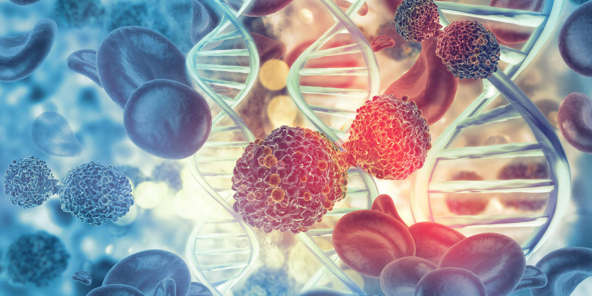

# WELCOME TO MY GITHUB PAGE

## About Me
Hi there, I'm Rotem! 

I'm an M.Sc. student at the Weizmann Institude in the ExCLS track. I'm currently rotating at [Prof. Tamar Geiger lab](https://www.weizmann.ac.il/mcb/TGeiger/home).
I LOVE science, and particularly interested in clinical cancer research! 

## Education
**B.Sc. in biology, Tel Aviv University**

I began my degree during high school through the Odyssey program at TAU. As part of this program, I also studied first-year chemistry courses.

## Research Experience
* I conducted a lab project in [Prof. Dudu Burstein's lab](https://burstein-lab.github.io/), The Shmunis School of Biomedicine and Cancer Research, Faculty of Life Sciences, TAU.
* I conducted an expanded lab project in [Prof. Yoni Haitin's lab](https://www.haitinlab.sites.tau.ac.il/), Department of Physiology and Pharmacology, Faculty of Medicine, TAU.

## Hobbies
When I'm not studying, I enjoy traveling🍁, going out with friends🍻, drawing🎨, and watching Netflix📺.
I also recently started learning Spanish, which has been a really fun new hobby for me!

### Contact
Feel free to reach out:

✉️**Email:** rotem.vazana@weizmann.ac.il

---

